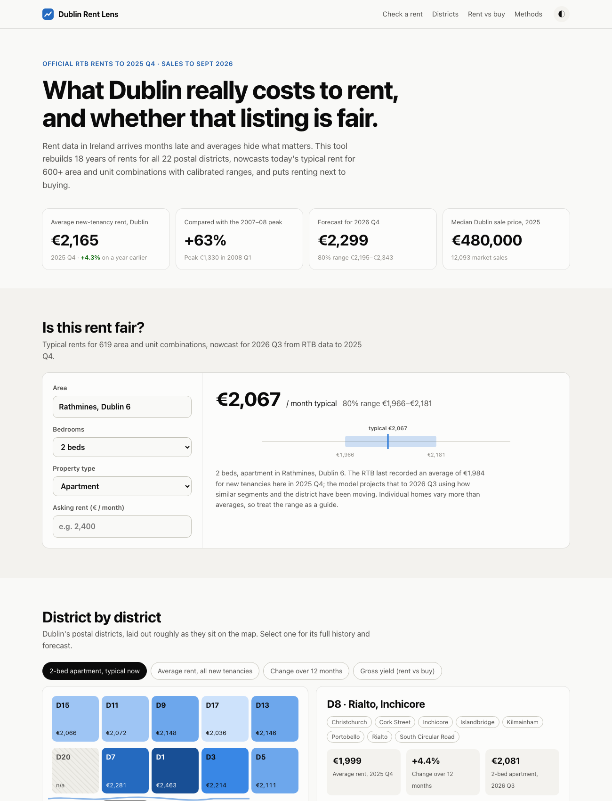

# Dublin Rent Lens

**Is that Dublin rent fair?** A live tool that rebuilds 18 years of Dublin rents from official data,
estimates what 600+ area and unit combinations typically rent for *today*, with calibrated ranges, and
puts renting next to buying.

**Live site → https://ppalande1903.github.io/dublin-rent-lens/**



## Why this exists

Irish rent statistics have two problems for anyone actually renting:

1. **They arrive late.** The RTB's quarterly figures lag by six months or more.
2. **Averages mislead.** An area full of small older flats shows a low *average* even when a like-for-like
   home there is expensive. In the current data, D1's average rent is below D24's, but a two-bed
   apartment in D1 costs about €560 a month more.

Dublin Rent Lens fixes both. It nowcasts rents segment by segment (area × bedrooms × property type) and
compares like with like.

## What's inside

| Piece | What it does |
|---|---|
| **Data pipeline** (`rentlens/data.py`) | Pulls the RTB rent report from the CSO PxStat API (148k Dublin rows, 2007 Q4 onwards) and the Property Price Register (130k Dublin market sales since 2010). Parses 160+ Dublin locations into district / neighbourhood / town, and places sales in postal districts via the Eircode routing key or the address. |
| **District reconstruction** (`rentlens/districts.py`) | The RTB **stopped publishing postal-district averages after 2021**. The pipeline rebuilds them by chain-linking each district's neighbourhood growth, and **validates** the method by rebuilding 2014–2021 and comparing with the official figures. |
| **Fair-rent nowcast** (`rentlens/fair.py`) | Gradient-boosted **quantile regression** predicts each segment's growth since its last RTB figure, as a correction to the district's trend. Ranges are **conformalised** (split-conformal CQR) so an 80% range really covers ~80% of outcomes. |
| **District forecast** (`rentlens/forecast.py`) | One global model pools all 22 districts, learns next-quarter growth from lags and seasonality, and runs recursively 4 quarters ahead. Bands come from the model's own backtest errors. |
| **Rent vs buy** (`rentlens/metrics.py`) | Gross yield and price-to-rent ratio per district, from the same year's rents and sale prices. |
| **Website** (`site/`) | Static, no framework and no chart library. It has a fair-rent checker, a district tile map (with the Liffey), history and forecast charts with crosshair tooltips, a keyboard-accessible table view, and dark mode. |
| **Automation** (`.github/workflows/refresh.yml`) | Every Monday: re-download the data, run the tests, retrain, re-evaluate, export and redeploy to GitHub Pages. |

## Results

Every model is scored on data it never saw, against simple baselines a sceptical analyst would try first.

**Fair-rent nowcast.** Trained on data to 2023, calibrated on 2024, tested on all of 2025, with inputs
frozen at 2024 Q4, so it is predicting up to a year past its data. That's 2,231 test segments.

| | Mean abs. % error |
|---|---|
| Carry the last value forward | 3.81% |
| Last value × district trend | 2.77% |
| **Model** | **2.68%** |

- **Ranges:** the 80% ranges covered **81.0%** of actual 2025 rents, with a median width of ±4.6%.
- **Where it wins:** the gain grows with staleness. At 4 quarters old the model's error is 3.25%, against 3.50% for the trend baseline and 5.06% for carry-forward. At 1 quarter the trend baseline is marginally better, and the site's methods table shows that honestly.

**District forecast.** Rolling-origin backtest, 12 forecast origins × 22 districts.

| Horizon | Model | Trend continues | No change |
|---|---|---|---|
| 1 quarter | **1.07%** | 1.13% | 1.36% |
| 2 quarters | **1.63%** | 1.84% | 2.49% |
| 3 quarters | **2.08%** | 2.46% | 3.63% |
| 4 quarters | **2.55%** | 3.09% | 4.82% |

**District reconstruction.** Rebuilding 2014–2021 from a 2013 anchor, compared with the official
figures: 1.4% error after one year, 3.0% after four, 3.3% on average over 668 district-quarters. I also
tried a fixed-basket index and non-negative weights learned from the overlap period. Both were slightly
worse, so chain-linking stayed.

## Run it

```bash
python3 -m venv .venv && .venv/bin/pip install -r requirements.txt
.venv/bin/python -m pytest -q                 # 15 tests: parsing, leakage, reconstruction, conformal coverage
.venv/bin/python -m rentlens.pipeline --refresh   # ~4 min: fetch, clean, evaluate, fit, export site/data/*.json
cd site && python3 -m http.server 8000        # open http://localhost:8000
```

## Design decisions worth asking me about

- **Predicting growth, not level.** Trees can't extrapolate a trend. Anchoring on each segment's last
  known rent and predicting the change (as a correction to the district trend) lets the model generalise
  to quarters it has never seen.
- **No look-ahead.** Training pairs only ever use anchors from before the target quarter, and evaluation
  freezes anchors at the cutoff. There's a test for it (`test_pairs_never_use_anchors_after_the_cutoff`).
- **Calibration over sharpness.** Quantile models are often over-confident; split-conformal widening
  fixes coverage with a guarantee under exchangeability. It's cheap and honest.
- **Like-for-like by default.** The map opens on "typical two-bed apartment", not the raw average,
  because the raw average mostly measures housing mix.
- **Static site.** Every prediction the checker can make is precomputed (the input space is discrete),
  so the site is fast, free to host and has no server to break.

## Limitations

- RTB figures are averages for new tenancies in a segment, not individual listings. A given flat can sit
  outside the range for good reasons.
- District values after 2021 are reconstructed (validated error above), not official.
- Gross yield ignores costs, vacancy and tax. It's a market indicator, not an investment return.

## Data & licences

- RTB Average Monthly Rent Report, CSO table RIQ02: [data.cso.ie](https://data.cso.ie/table/RIQ02), CC BY 4.0.
- Property Price Register: [propertypriceregister.ie](https://www.propertypriceregister.ie), Property Services Regulatory Authority.

---

Built by **Prachiti Palande**, M.Sc. Computer Science, University College Dublin ·
[Portfolio](https://ppalande1903.github.io/pixel-portfolio/) · [LinkedIn](https://www.linkedin.com/in/prachiti-palande-947842284)
